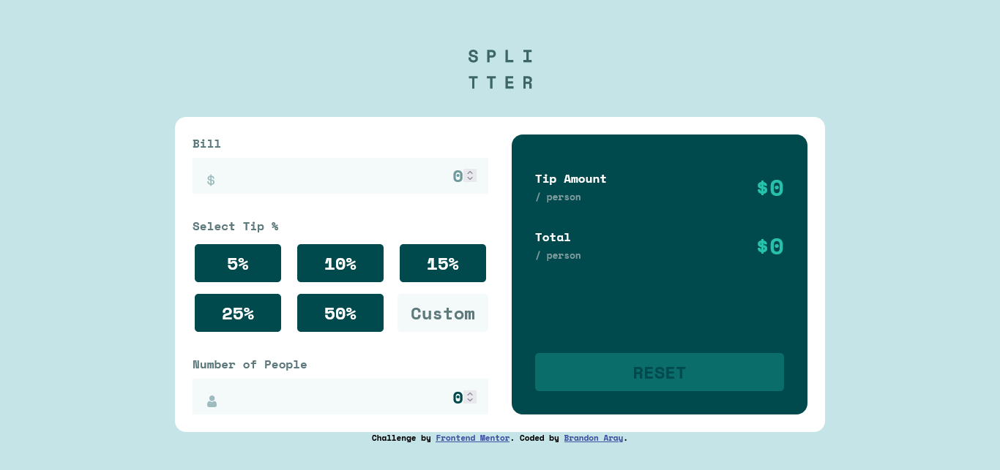

# Frontend Mentor - Tip calculator app solution

This is a solution to the [Tip calculator app challenge on Frontend Mentor](https://www.frontendmentor.io/challenges/tip-calculator-app-ugJNGbJUX). Frontend Mentor challenges help you improve your coding skills by building realistic projects.

## Table of contents

- [Overview](#overview)
  - [The challenge](#the-challenge)
  - [Screenshot](#screenshot)
  - [Links](#links)
- [My process](#my-process)
  - [Built with](#built-with)
  - [What I learned](#what-i-learned)
  - [Continued development](#continued-development)
  - [Useful resources](#useful-resources)
- [Author](#author)

## Overview

### The challenge

Users should be able to:

- View the optimal layout for the app depending on their device's screen size
- See hover states for all interactive elements on the page
- Calculate the correct tip and total cost of the bill per person

### Screenshot



### Links

- Solution URL: https://github.com/branalex94/tip-calculator
- Live Site URL: https://branalex94.github.io/tip-calculator

## My process

### Built with

- Semantic HTML5 markup
- CSS custom properties
- Flexbox
- CSS Grid
- Mobile-first workflow
- [React](https://reactjs.org/) - JS library
- [Vite.js](https://vitejs.dev/) - JavaScript bundler

### What I learned

I'm really proud of this implementation of SVG icons as components. It made it kind of easy to apply them on the component.

```js
const ICONS = {
  dollar: <Dollar />,
  person: <Person />,
};

<div className="input__icon-container">{ICONS[icon]}</div>;
```

### Continued development

I'm planning on continuosly working on writing cleaner and more optimal code.

### Useful resources

- [Css Tricks](https://css-tricks.com/snippets/css/a-guide-to-flexbox/) - This resource helped me remember the correct functionality of flexbox.

## Author

- GitHub - [branalex94](https://www.github.com/branalex94)
- Frontend Mentor - [@branalex94](https://www.frontendmentor.io/profile/branalex94)
